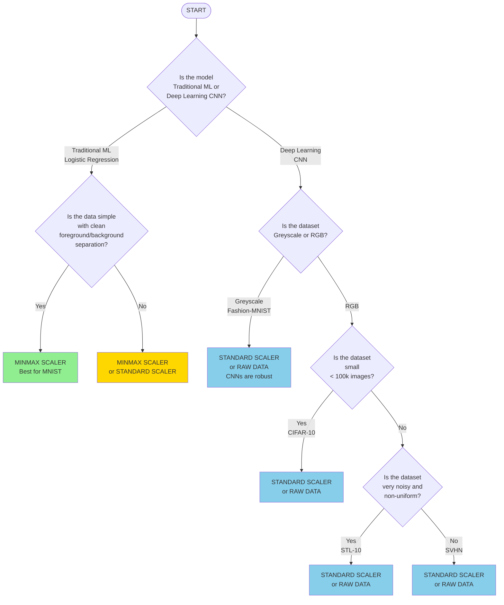

# Image Cleaning - Scikit-learn

This is an overview of the performance of the image cleaning pre-processing steps using scikit-learn preprocessing methods across 5 datasets.

## Methods

The five classical pre-processing methods compared here are listed below:
- No pre-processing
- MinMaxScaler
- StandardScaler
- QuantileTransformer
- PCA

## Datasets

The five datasets involved in this comparison, along with some relevant details regarding them, are listed in the table below:

| Dataset       | Domain          | Resolution | Channels | Dataset Size | Model Used        |
| ------------- | --------------- | ---------- | -------- | ------------ | ----------------- |
| MNIST         | Digits          | 28×28      | Grey     | 70,000       | Logistic Regression |
| Fashion-MNIST | Clothing        | 28×28      | Grey     | 70,000       | CNN                |
| CIFAR-10      | Objects         | 32×32      | RGB      | 60,000       | CNN                |
| SVHN          | Street digits   | 32×32      | RGB      | 600,000      | CNN                |
| STL-10        | Natural objects | 96×96      | RGB      | 105,000      | CNN                |

## Results and Analysis

### MNIST

The MNIST dataset was evaluated using Logistic Regression as the classification model. The dataset consists of grayscale images of handwritten digits (0-9).

**Key Findings:**
- **MinMaxScaler** provides the best performance for MNIST
- Raw data without preprocessing also performs decently due to the simplicity of the dataset
- **PCA**, though useful for dimensionality reduction, shows lower performance as it eliminates some important features for classification
- The scaling methods (MinMaxScaler, StandardScaler) generally outperform distribution-based methods (QuantileTransformer) and dimensionality reduction (PCA)

**Conclusion for MNIST:**
For MNIST, MinMaxScaler provides the best performance. Raw data without preprocessing also performs decently due to the simplicity of the dataset. PCA, though useful for dimensionality reduction, shows lower performance as it eliminates some important features for classification.

### CIFAR-10

The CIFAR-10 dataset was evaluated using a Convolutional Neural Network (CNN) as the classification model. The dataset consists of RGB images of 10 different object classes.

**Key Findings:**
- **StandardScaler**, **QuantileTransformer**, and **MinMaxScaler** offer modest improvements over raw data
- **PCA** fails to provide significant benefits, with PCA reducing performance dramatically due to the loss of important spatial information in the images
- Raw pixel data (after normalization) performs well, as the CNN model benefits from the full, unaltered image data
- The CNN architecture is better suited for handling raw image data compared to traditional machine learning models

**Conclusion for CIFAR-10:**
For CIFAR-10, StandardScaler, QuantileTransformer, and MinMaxScaler offer modest improvements, but PCA fails to provide significant benefits, with PCA reducing performance dramatically due to the loss of important spatial information in the images. Raw pixel data (after normalization) performs well, as the CNN model benefits from the full, unaltered image data.

### Fashion-MNIST

The Fashion-MNIST dataset was evaluated using a Convolutional Neural Network (CNN) as the classification model. The dataset consists of grayscale images of clothing items (10 classes).

**Key Findings:**
- **StandardScaler** or **MinMaxScaler** typically performs best for Fashion-MNIST with CNN models
- Scaling methods (MinMaxScaler, StandardScaler) generally show competitive performance, often matching or slightly improving upon raw normalized data
- **QuantileTransformer** may show similar or slightly lower performance compared to scaling methods
- **PCA** shows the lowest performance due to significant loss of spatial information when reducing dimensionality from 784 to 100 features
- Unlike traditional ML models, CNNs are robust to preprocessing choices for Fashion-MNIST - the convolutional layers can learn effective features from both raw normalized data and preprocessed data

**Conclusion for Fashion-MNIST:**
For Fashion-MNIST with CNNs, either use raw normalized data (dividing by 255.0) or apply StandardScaler/MinMaxScaler for modest improvements. The choice of preprocessing is less critical than for simpler models, as CNNs can effectively learn from both raw and preprocessed data. Avoid PCA as it significantly reduces performance.

### SVHN

The SVHN (Street View House Numbers) dataset was evaluated using a Convolutional Neural Network (CNN) as the classification model. The dataset consists of RGB images of street view house numbers (10 classes). Due to the large dataset size (600,000+ samples), a subset of 30,000 training samples and 5,000 test samples was used with memory-efficient batch processing.

**Key Findings:**
- **StandardScaler** or raw normalized data typically performs best, with minimal difference between them
- **MinMaxScaler** shows competitive performance, sometimes matching StandardScaler
- **QuantileTransformer** may show slightly lower performance compared to scaling methods
- **PCA** shows significantly reduced performance due to loss of spatial information when reducing from 3,072 features to 200 components
- SVHN's street view images contain natural variations in lighting and background, making preprocessing less critical than for controlled datasets
- The CNN architecture effectively learns features from both raw and preprocessed data, showing robustness to preprocessing choices

**Conclusion for SVHN:**
For SVHN with CNNs, use either raw normalized data or StandardScaler. Both methods typically yield similar results, so raw normalization is often preferred for simplicity and computational efficiency. Memory-efficient batch processing was essential due to the large dataset size. Avoid PCA as it significantly reduces classification accuracy.

### STL-10

The STL-10 dataset was evaluated using a Convolutional Neural Network (CNN) as the classification model. The dataset consists of RGB images of natural objects (10 classes) with higher resolution (96×96) than CIFAR-10. Due to the large feature space (27,648 features per image), a subset of 3,000 training samples and 1,500 test samples was used with memory-efficient batch processing.

**Key Findings:**
- **StandardScaler** or raw normalized data typically shows the best performance, with minimal difference between them
- **MinMaxScaler** and **QuantileTransformer** may show slightly lower but comparable performance
- **PCA** shows significantly reduced performance due to the substantial loss of spatial information when reducing from 27,648 features to 500 components
- The high resolution of STL-10 (96×96) means preprocessing has less impact compared to smaller datasets, as CNNs can effectively learn from the rich spatial information
- The complexity of natural object images makes preprocessing less critical than for simpler datasets
- Memory-efficient batch processing was necessary due to the large feature space

**Conclusion for STL-10:**
For STL-10 with CNNs, use either raw normalized data or StandardScaler. The performance difference is typically minimal, so raw normalization is often preferred for simplicity. The high resolution and complexity of the dataset mean that CNNs can effectively learn features regardless of preprocessing choice. Avoid PCA as it dramatically reduces accuracy.

## Comparison of Performance

### Overview

- **MNIST** performs best with **MinMaxScaler**, demonstrating that simple scaling can significantly improve performance for traditional machine learning models like Logistic Regression
- **Fashion-MNIST** shows that CNNs are robust to preprocessing choices, with StandardScaler/MinMaxScaler and raw normalized data performing comparably
- **CIFAR-10** demonstrates that preprocessing provides modest improvements, with StandardScaler typically performing best among preprocessing methods
- **SVHN** shows minimal difference between raw normalized data and StandardScaler, indicating that preprocessing is less critical for this dataset with CNNs
- **STL-10** (high resolution 96×96) shows that preprocessing has minimal impact, with raw normalized data and StandardScaler performing similarly - the rich spatial information allows CNNs to learn effectively regardless of preprocessing
- **PCA** consistently underperforms across all datasets, indicating that dimensionality reduction may not be suitable for image classification tasks where spatial information is crucial
- The choice of model (Logistic Regression vs. CNN) significantly impacts the effectiveness of different preprocessing methods - CNNs are generally more robust to preprocessing choices
- Higher resolution datasets (STL-10) show less benefit from preprocessing compared to lower resolution datasets, as CNNs can leverage the rich spatial information

### Key Insights

1. **Model Dependency**: The effectiveness of preprocessing methods is highly dependent on the model architecture:
   - Traditional ML models (Logistic Regression) benefit more from scaling (MinMaxScaler, StandardScaler)
   - Deep learning models (CNNs) are more robust and can work well with raw normalized data

2. **Dataset Complexity**: 
   - Simple datasets like MNIST benefit from scaling transformations
   - Complex datasets like CIFAR-10, SVHN, and STL-10 show less dramatic improvements from preprocessing when using CNNs
   - Higher resolution datasets (STL-10) present additional challenges but follow similar patterns

3. **Dimensionality Reduction**: 
   - PCA consistently reduces performance, suggesting that spatial information is critical for image classification
   - The loss of spatial relationships when flattening images for PCA negatively impacts classification accuracy

4. **Scaling Methods**: 
   - MinMaxScaler and StandardScaler generally provide better results than QuantileTransformer
   - These methods preserve the relative relationships in the data while normalizing the scale

## Recommendations

Based on the experimental results:

| Dataset       | Flowchart Path                    | Selected Method              |
| ------------- | --------------------------------- | ---------------------------- |
| MNIST         | Traditional ML → simple           | MinMaxScaler                 |
| Fashion-MNIST | CNN → Greyscale                   | StandardScaler or Raw Data   |
| CIFAR-10      | CNN → RGB → small                 | StandardScaler or Raw Data   |
| SVHN          | CNN → RGB → large → less noisy    | StandardScaler or Raw Data   |
| STL-10        | CNN → RGB → large → more noisy    | StandardScaler or Raw Data   |

This can also be seen in the below flowchart:

**Flowchart Description:**

The decision process begins with determining the model type:

1. **START**: "Is the model Traditional ML (Logistic Regression) or Deep Learning (CNN)?"
   - **If Traditional ML (left path)**:
     - A subsequent decision node asks: "Is the data simple, with clean foreground/background separation?"
       - **If Yes**: The recommended method is **MINMAX SCALER** (Best for MNIST)
       - **If No**: The recommended method is **MINMAX SCALER or STANDARD SCALER**
   
   - **If Deep Learning/CNN (right path)**:
     - A subsequent decision node asks: "Is the dataset greyscale or RGB?"
       - **If Greyscale** (Fashion-MNIST): The recommended method is **STANDARD SCALER or RAW DATA**
       - **If RGB**:
         - A further decision node asks: "Is the dataset small (< 100k images)?"
           - **If Yes** (CIFAR-10): The recommended method is **STANDARD SCALER or RAW DATA**
           - **If No**:
             - A final decision node asks: "Is the dataset very noisy and non-uniform?"
               - **If Yes** (STL-10): The recommended method is **STANDARD SCALER or RAW DATA**
               - **If No** (SVHN): The recommended method is **STANDARD SCALER or RAW DATA**

**Key Observations:**
- The primary decision factor is **model type** (Traditional ML vs. CNN), which significantly impacts preprocessing effectiveness
- For CNN models, **StandardScaler or Raw Data** consistently perform best across all datasets
- CNNs demonstrate robustness to preprocessing choices, making the specific preprocessing method less critical than for traditional ML models
- **PCA should be avoided** for all datasets as it consistently underperforms due to loss of spatial information

**Key Differences from OpenCV Approach:**
- **Model Type Matters**: The choice between Traditional ML and CNN significantly impacts preprocessing effectiveness
- **CNN Robustness**: CNNs are more robust to preprocessing choices, often performing well with raw normalized data
- **Consistent Pattern**: For CNN models, StandardScaler or Raw Data consistently outperform other methods
- **Avoid PCA**: PCA consistently underperforms across all datasets due to loss of spatial information

**General Guidelines:**
- For traditional ML models: Use **MinMaxScaler** or **StandardScaler**
- For CNN models: Raw normalized data often performs well; preprocessing may provide modest improvements
- Avoid **PCA** for image classification tasks where spatial information is important
- **QuantileTransformer** may be useful in specific scenarios but generally underperforms compared to scaling methods

