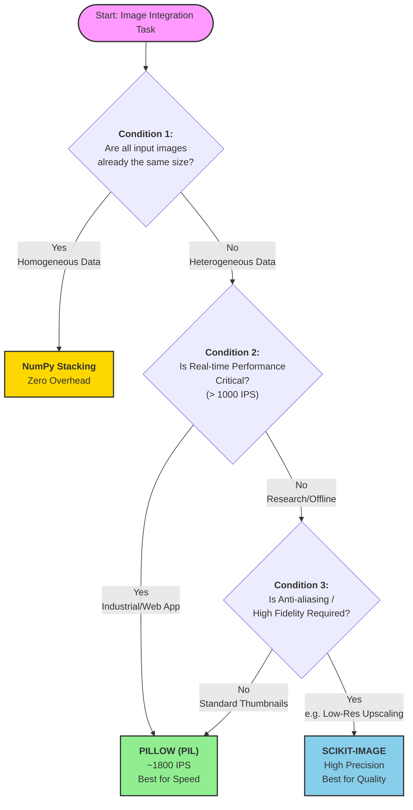

# A Comparison of Image Processing Techniques

The aim of this project is to analyse how image processing techniques perform in terms of image cleaning, image enrichment, and image integration. 

## Image Cleaning
The image cleaning techniques implemented via both Scikit-Learn and OpenCV were:
- **No Cleaning**: no alterations were performed on the data.
- **MinMaxScaler**: the pixel values were scaled between 0 and 1.
- **StandardScaler**: the pixel values were normalised (mean=0, unit variance).
- **QuantileTransformation**: the pixel values were normalised based on the quantiles.
- **PCA**: this involves the projection of the principal components that account for maximum variance.

The datasets used here are the MNIST, CIFAR-10, Fashion-MNIST, SVHN, and STL-10 datasets.

A breakdown of the performance in each implementation is provided below.

### OpenCV
- The codes available in [this directory](https://github.com/kartika-nair/ImageProcessing-COMP6235/tree/main/Image%20Cleaning%20-%20OpenCV) contain the implementation of the aforementioned cleaning methods in OpenCV.
- The predictions were done via an RNN, and further details have been provided within the repository.
- The results were as follows:

### Scikit-Learn
- The codes available in [this directory](https://github.com/kartika-nair/ImageProcessing-COMP6235/tree/main/Image%20Cleaning%20-%20Scikit-Learn) contain the implementation of the aforementioned cleaning methods in Scikit-Learn.
- The predictions were done via a CNN, and further details have been provided within the repository.
- The results were as follows:

## Image Enrichment
The image enrichment techniques implemented via both TensorFlow and OpenCV were:
- **Baseline**
  - No augmentation  
  - **Method 0**
- **Level 1 (L1, OpenCV-style geometric augmentation)**
  - RandomRotation — **Method 1**
  - RandomTranslation — **Method 2**
  - RandomZoom — **Method 3**
  - Geometric-Combined (Rotation + Translation + Zoom) — **Method 4**
- **Level 2 (L2, TensorFlow-based augmentation)**
  - MixUp — **Method 5**
  - CutMix — **Method 6**
  - RandAugment — **Method 7**
 
### OpenCV
- The codes available in [this directory](https://github.com/kartika-nair/ImageProcessing-COMP6235/tree/main/Image%20Enrichment%20-%20openCV) contain the implementation of the aforementioned cleaning methods in OpenCV.
- The results were as follows:

| **Dataset** | **Baseline Accuracy (No Processing)** | **Best Augmentation Method** | **Best Accuracy** | **Average ΔAcc (%)** | **Overall Suitability** |
|------------|---------------------------------------|------------------------------|-------------------|----------------------|-------------------------|
| **MNIST** | 0.964 | Noise | 0.965 | −0.4% | Very Low |
| **FashionMNIST** | 0.840 | Scaling | 0.831 | −0.6% | Low |
| **CIFAR-10** | 0.372 | Rotation | 0.380 | +0.2% | Moderate |
| **SVHN** | 0.694 | Blur | 0.701 | +0.5% | High (Selective) |
| **STL-10** | 0.151 | Scaling | 0.205 | +1.5% | Moderate–High |

### TensorFlow 
- The codes available in [this directory](https://github.com/kartika-nair/ImageProcessing-COMP6235/edit/main/Image%20Enrichment%20-%20Tensorflow) contain the implementation of the aforementioned cleaning methods in TensorFlow.
- The results were as follows:

| Dataset | Baseline Acc | L1 Avg ΔAcc | L2 Avg ΔAcc | Best Method (Overall) | Best Acc | Δ vs Baseline (pp) | Evaluation |
|---|---:|---:|---:|---|---:|---:|---|
| MNIST | 0.9899 | +0.15% | +0.11% | Rotation (L1) | 0.9930 | +0.31 | No Clear Gain |
| Fashion-MNIST | 0.9181 | −2.85% | −0.89% | MixUp (L2) | 0.9184 | +0.03 | L2 Best |
| CIFAR-10 | 0.7073 | −2.07% | −0.31% | RandAugment (L2) | 0.7109 | +0.36 | L2 Best |
| SVHN | 0.9015 | −0.04% | −1.09% | Translation (L1) | 0.9152 | +1.37 | L1 Best |
| STL-10 | 0.6077 | +2.21% | +1.09% | Translation (L1) | 0.6804 | +7.27 | L1 Best |

## Image Integration
The image integration techniques implemented were:
- Pillow
- Scikit-Image
- OpenCV

The codes available in [this directory](https://github.com/kartika-nair/ImageProcessing-COMP6235/tree/main/%E6%95%B0%E6%8D%AE%E6%95%B4%E5%90%88) contain the implementation of the same. This was performed on the SVHN, MNIST, and USPS datasets.

The results were as follows:

