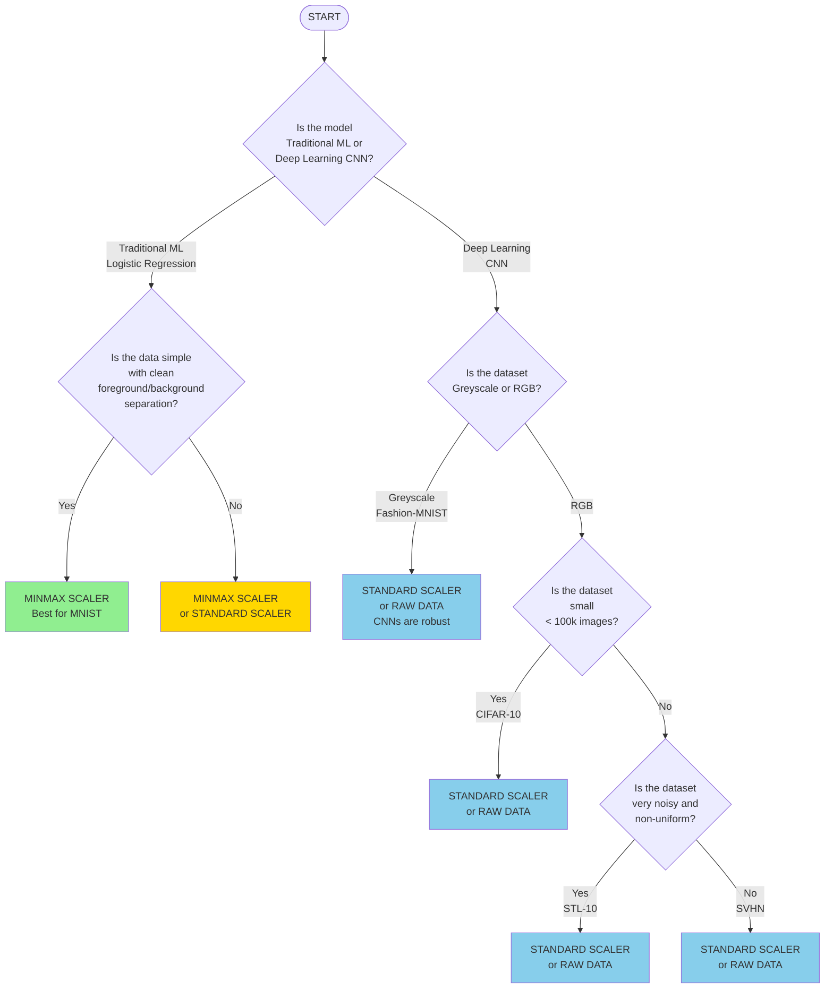

# A Comparison of Image Processing Techniques

The aim of this project is to analyse how image processing techniques perform in terms of image cleaning, image enrichment, and image integration. 

## Image Cleaning
The image cleaning techniques implemented via both Scikit-Learn and OpenCV were:
- **No Cleaning**: no alterations were performed on the data.
- **MinMaxScaler**: the pixel values were scaled between 0 and 1.
- **StandardScaler**: the pixel values were normalised (mean=0, unit variance).
- **QuantileTransformation**: the pixel values were normalised based on the quantiles.
- **PCA**: this involves the projection of the principal components that account for maximum variance.

The datasets used here are the MNIST, CIFAR-10, Fashion-MNIST, SVHN, and STL-10 datasets.

A breakdown of the performance in each implementation is provided below.

### OpenCV
- The codes available in [this directory](https://github.com/kartika-nair/ImageProcessing-COMP6235/tree/main/Image%20Cleaning%20-%20OpenCV) contain the implementation of the aforementioned cleaning methods in OpenCV.
- The predictions were done via an RNN, and further details have been provided within the repository.
- The results were as follows:

### Scikit-Learn
- The codes available in [this directory](https://github.com/kartika-nair/ImageProcessing-COMP6235/tree/main/Image%20Cleaning%20-%20Scikit-Learn) contain the implementation of the aforementioned cleaning methods in Scikit-Learn.
- The predictions were done via a CNN, and further details have been provided within the repository.
- The results were as follows:

## Image Integration
The image integration techniques implemented were:
- Pillow
- Scikit-Image
- OpenCV

The codes available in [this directory](https://github.com/kartika-nair/ImageProcessing-COMP6235/tree/main/%E6%95%B0%E6%8D%AE%E6%95%B4%E5%90%88) contain the implementation of the same. This was performed on the SVHN, MNIST, and USPS datasets.

The results were as follows:

