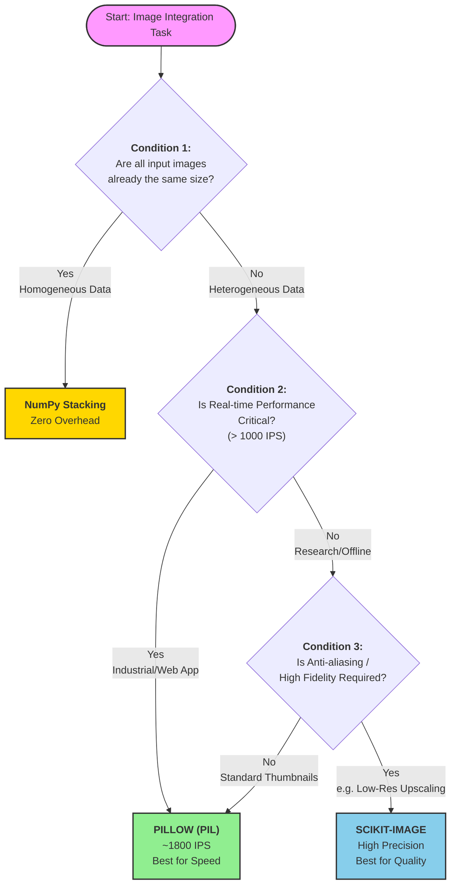

# Image integration - the fusion of different data sources

In real life, data often comes from scattered sources and has different attributes (covering various data types, formats and modalities). If the input data is not standardized uniformly, it often leads to the failure of model training.

Compared with text and tables, image data contains multiple layers of features such as color, texture, and shape. Therefore, we select images as samples for the processing capabilities of the test data preparation tool.

In image data preparation, "integration" refers to the process of mapping image data from scattered images (with different resolutions and color Spaces) to a unified feature space through mathematical transformation and resampling techniques. This can ensure that all data input sources meet the requirements of consistent size, channel and type before entering the data analysis.

## Integrated tool

First, we conducted a survey on the current mainstream image integration tools

- Pillow
  - Positioning: The basic library for image processing
  - Features: Object-based, no need for underlying knowledge (the underlying layer is already encapsulated), quickly implementing general requirements (web development, batch processing)

- Scikit-image(Skimage)
  - Positioning: An expansion of the scientific computing library Scipy
  - Features: Based on arrays, it regards images as Numpy matrices and provides a large number of mathematical algorithms (transformation, filtering, etc.), mainly used for scientific research and algorithm customization design

- OpenCV(Open Source Computer Vision Library)
  - Positioning: A powerful application in the field of computer vision
  - Features: Powerful functions, covering the entire process from preprocessing to deep learning.

Although OpenCV is powerful, its learning curve is rather steep for a pure Python data science pipeline. Therefore, in this experiment, we chose Pillow and Skimage as the integrated tools for the test. They more representatively embody both engineering and scientific processing methods.

The underlying layer of Pillow uses lookup tables and integer operations written in c language. Choosing it allows us to know to what extent image quality can be sacrificed for speed in experiments.

The underlying logic of Scimage is matrix computation and convolution. Choosing it enables us to know how much computing time can be consumed in scientific research scenarios to achieve data fidelity.

## Experimental design

Our core objective is to ensure that the input data meets the unified formatting requirements through image integration technology, facilitating subsequent analysis and use. And evaluate the performance of different image processing tools when actually preparing data.

For a comprehensive assessment of the processing capabilities of the integrated tools in different scenarios in the future, we selected three datasets with significant differences in resolution, color and clarity as samples.

| Dataset   | Domain                    | Resolution | Channels  | Characteristics                                              |
| :-------- | :------------------------ | :--------- | :-------- | :----------------------------------------------------------- |
| **SVHN**  | Street View House Numbers | 32×32      | RGB       | Complex background; represents real-world uncontrolled environments. |
| **MNIST** | Handwritten Digits        | 28×28      | Greyscale | Clean background with clear strokes; represents standardized cross-domain data. |
| **USPS**  | Scanned Mail Digits       | 16×16      | Greyscale | **Low Resolution** and blurry; represents low-quality legacy data. |

In response to the attribute differences of the above-mentioned multi-source data, we have established a standardized integration process

- Size alignment

Based on the upper limit of the maximum resolution of the original data, all input images are forcibly resampled to 32×32 pixels, with a focus on examining the impact of the difference algorithm on the clarity of image edges

- Channel alignment

Detect the number of channels of the image. If it is a single channel, replicate and project it as a three-channel RGB. Ensure that all data can be processed in the same model and that the shapes of the samples are exactly the same.

- Type standardization

The original integer values of image pixels can make gradient updates difficult. Normalizing pixel values to the [0, 1] interval can eliminate dimensional differences and accelerate model convergence.

- Statistical standardization

To prevent the model from also incorporating luminance as part of distinguishing digital features, the formula $X_{std} = (X - \mu) / \sigma$is applied to shift the pixel distribution center to 0 and scale the standard deviation to 1.

To evaluate the actual impact of data integration on downstream analysis tasks, a convolutional neural network (CNN) model was introduced to verify the effectiveness of data preparation. A CNN consisting of two convolutional and Max pooling layers was constructed, and the random Seed (Seed=42), hyperparameters, and initialization weights were locked. It is proved that the data produced by the integration not only ensures the uniformity of the format but also solves the practical problem of performance optimization.

## Analysis of Core Indicators

- IPS (Images Per Second, the number of images processed per second)

In scenarios where a large amount of data is processed, the efficiency of the data preparation stage is of vital importance. We select the total time consumed in processing 7,500 images to calculate the processing rate.

| Metric                   | Pillow Solution | Scikit-image Solution | Difference                |
| :----------------------- | :-------------- | :-------------------- | :------------------------ |
| **Total Execution Time** | 4.14 s          | 83.89 s               | Skimage is ~20x slower    |
| **Average Throughput**   | **1809.73 IPS** | 89.40 IPS             | **Pillow is ~20x faster** |

The operation log shows that Pillow demonstrates an approximately 20-fold advantage in processing speed. The rapid processing of Pillow benefits from the underlying C language lookup table (LUT) and simple integer operations. However, since Skimage performs Gaussian smoothing filtering by default during resampling, it involves a large number of floating-point convolution operations, resulting in a significant increase in computing time.

- Signal Fidelity

Different Resampling Algorithms will change the pixel features of the image. By comparing the magnified effect of low-resolution images, we can observe whether there is a phenomenon of "Aliasing" or "Blurring".

When Pillow was handling the USPS (16×16) upsampling task, obvious Pixelation and Aliasing appeared at the image edges. The image edges processed by Scikit-image are very Smooth, high-frequency noise is effectively suppressed, but visually it appears slightly blurry.

In addition, residual analysis was conducted on the test set matrices produced by the two tools to quantify the differences in the underlying algorithms.

Mean square error (MSE): $0.00005576$

Maximum pixel Difference: $0.1358$(range 0-1)

Pearson correlation coefficient: $0.999703$

The correlation coefficient is close to 1.0, indicating that both have successfully completed the dimension alignment and normalization of cross-domain data.

- Validation Accuracy of the validation set

  The ultimate goal of data preparation is to serve the model. We input the two sets of processed data into exactly the same CNN model and determine which data features are more conducive to neural network extraction based on the final classification accuracy.

  The final test accuracy rate of the Pillow solution was 89.53%. Its sharp feature retention helps the model to perform deep fitting in the later stage. The final test accuracy rate of the Skimage solution was 88.60%. However, it reached the peak of 90.00% in the 6th round, indicating that the pure signal provided by anti-aliasing can more effectively assist in feature capture in the early stage of training.

  This result also explains the core contradiction in data preparation. High quality (no aliasing) in our eyes does not equal prominent features (easy recognition) in the eyes of machines. In simple digital recognition tasks, retaining the original sharp edges is more valuable than smooth denoising.

  The Loss decline curves of the two highly overlap, indicating that the basic Z-Score normalization (mean/standard deviation alignment) is more capable of determining the convergence trend of the model than the scaling algorithm itself.

## Conclusion

There is no "best" tool, only the "most suitable" scenario

Pillow is suitable for: large-scale, high-throughput, and simple industrial-grade tasks (such as OCR, license plate recognition). Scikit-image is suitable for small-scale, high-precision, noise-sensitive scientific research tasks (such as microscope analysis, low-resolution old photo restoration), because at this time, "anti-aliasing" is the key to preventing the model from learning incorrect noise.

Based on the above experiments, we have constructed the following decision tree for integrated tool selection:

